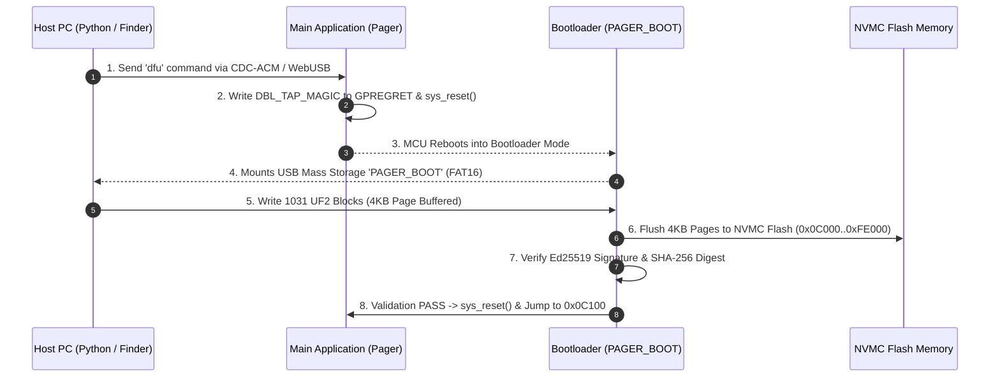

# Pager firmware

Custom bare-metal firmware for the **Pager** device (nRF52840, based on a nice!nano v2 board) running async Rust with **Embassy**. It exposes a vendor-specific WebUSB control plane, Ed25519-signed UF2 firmware updates, USB CDC-ACM serial logs, and BLE HID keyboard emulation built on `nrf-sdc`.

---

## 🚀 Key Features

*   **Single-Slot Secure UF2 Bootloader**: 48 KB bootloader with Ed25519 digital signature validation, SHA-256 integrity verification, 4KB page buffering, and Double-Tap reset trigger. Auto-mounts over USB as `PAGER_BOOT`.
*   **WebUSB Control Plane**: Direct USB bulk interface for control commands and signed DFU updates accessible via WebUSB.
*   **CDC-ACM Serial Logging**: Stream real-time diagnostic logs over standard USB serial (`/dev/cu.usbmodem*`).
*   **BLE GATT & HID Keyboard**: Advertises as `Pager` and emulates a full Bluetooth Low Energy HID keyboard with 3 profile slots, pairing mode control, and text typing emulation.
*   **Web Bluetooth UI**: A static client webpage (`ble_client.html`) using Chrome Web Bluetooth to connect directly to the board over BLE, control the LED, and view live heartbeat logs.

Each USB descriptor serial is derived from the nRF52840 factory device ID.
When several boards are connected, use `SERIAL_PORT` to select one explicitly;
`PAGER_USB_SERIAL`, `PAGER_USB_VID`, and `PAGER_USB_PID` additionally filter
automatic discovery.

## Security and trust boundary

The WebUSB and CDC command interfaces trust **only the host that is physically connected to the board by USB**. A physically connected host can update firmware, alter BLE profiles, and send keyboard input; signed packages remain mandatory for boot.

---

## 💾 Memory Layout (nRF52840 Bare-Metal)

| Partition | Start Address | Size | Purpose |
| :--- | :--- | :--- | :--- |
| **Bootloader** | `0x00000` | 48 KiB (`0x0C000`) | Ed25519 signature verification, Double-Tap reset, USB UF2 DFU |
| **Manifest Header** | `0x0C000` | 256 B | Digital signature (`PGRFW001`), SHA-256 digest, metadata |
| **Main Application** | `0x0C100` | 903.75 KiB | Embassy async firmware (`pager`) |
| **Storage & bonds** | `0xFE000` | 8 KiB | Persistent BLE profile and bond state |

---

## 🛠️ Prerequisites

Before building, install the standard Rust target and object copy utility:

```bash
# Install the ARM Thumbv7EM compiler target
rustup target add thumbv7em-none-eabihf

# Install cargo-binutils for objcopy tools
cargo install cargo-binutils
```

Install host test dependencies into an isolated environment:

```bash
python3 -m venv .venv
.venv/bin/pip install -r tests/requirements.txt
```

### Generate local firmware-signing keys

Before the first `make build`, `make flash`, or `make ci`, create the local
Ed25519 signing keys. The build expects both a current key and a next key for
key-rotation verification. `keys/` is intentionally ignored by Git: keep the
private PEM files only on trusted development machines.

Linux and macOS (requires OpenSSL 3 or newer):

```bash
mkdir -p keys
openssl genpkey -algorithm Ed25519 -out keys/firmware_signing_private.pem
openssl pkey -in keys/firmware_signing_private.pem -pubout \
  -out keys/firmware_signing_public.pem
openssl genpkey -algorithm Ed25519 -out keys/firmware_signing_next_private.pem
openssl pkey -in keys/firmware_signing_next_private.pem -pubout \
  -out keys/firmware_signing_next_public.pem
```

Do not regenerate these files after a package has been deployed: the
bootloader can only validate packages signed by a public key embedded in its
own firmware. A deliberate key rotation requires embedding the next public
key and deploying that bootloader first.

### DFU Flashing Architecture



# 📦 Build & Flash via Makefile

A standard `Makefile` is available for building, flashing, and testing:

```bash
# 1. Build release firmware & dist/pager.uf2
make build

# 2. Flash via USB UF2 Bootloader
make flash               # or: python3 tools/flash_uf2.py

# 3. Flash via SWD Probe (Hardware Recovery)
make flash-swd
```

---

## ⚡ How to Flash

### 1. Flash via USB UF2 Bootloader (Default)
Transfer the Ed25519-signed UF2 image over USB:
```bash
make flash
```

### 2. Flash via SWD Probe (Hardware Recovery)
Program both the 48 KB bootloader and signed application payload over SWD using `probe-rs`:
```bash
make flash-swd
```

---

## 🧪 Verification & Local Testing

> [!IMPORTANT]
> - **Platform Target**: All build scripts, USB tools, `libusb` dynamic bindings (`/opt/homebrew/lib/libusb-1.0.dylib`), and HIL tests are designed exclusively for **macOS**.
> - **No CI/CD Pipelines**: CI/CD pipelines are omitted by design. All compilation, linting, unit tests, and hardware tests are executed locally by developers.

Run local verification checks before committing:

```bash
make ci
```

This runs code formatting checks (`cargo fmt`), Clippy linter, bootloader compilation, protocol unit-tests, layout validation, and builds/signs the release package.
