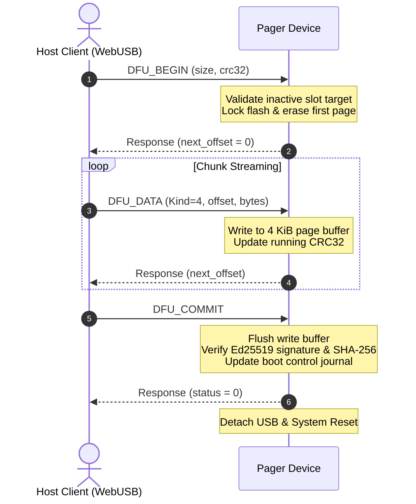

# Pager USB protocol v1

Pager exposes a vendor-specific WebUSB bulk interface alongside CDC-ACM serial
for logs and emergency DFU recovery. A client must claim the vendor interface
(class `0xff`) and use its bulk IN/OUT endpoints.

## Frame Structure

All frames are little-endian and can span multiple USB transfers.

| Offset | Size | Field |
| --- | ---: | --- |
| 0 | 4 | ASCII `PGR1` |
| 4 | 1 | Protocol version (`1`) |
| 5 | 1 | Kind: command `1`, response `2`, event `3`, DFU data `4`, error `5` |
| 6 | 4 | Request ID; zero for unsolicited events/errors |
| 10 | 2 | Payload length, maximum 512 |
| 12 | 4 | IEEE CRC-32 of payload |
| 16 | n | Payload |

The device rejects an invalid header, version, length, kind, or CRC and never
writes to flash before a valid DFU transaction is established.

## Error Kinds & Error Codes

When `kind` is `5` (`Error`), the single-byte error payload indicates:
- `1`: `ERR_BAD_REQUEST` — Malformed frame header or invalid parameters
- `2`: `ERR_UNSUPPORTED_COMMAND` — Unknown opcode
- `3`: `ERR_BUSY` — Resource currently locked or busy
- `4`: `ERR_DFU` — Staging flash error, CRC mismatch, or wrong slot target

## Implemented Bootstrap Commands

Command payloads contain a one-byte opcode followed by parameters:

| Opcode | Name | Response |
| ---: | --- | --- |
| `1` | `PING` | ASCII `PONG` |
| `2` | `GET_INFO` | ASCII `Pager;protocol=1` |
| `3` | `GET_KEYBOARD_STATE` | `active_slot, pairing_mode, bonded0, bonded1, bonded2` |
| `4, slot` | `SWITCH_PROFILE` | status byte (`0`), slot 0–2 |
| `5` | `ENABLE_PAIRING` | status byte (`0`) |
| `6` | `DISCONNECT` | status byte (`0`) |
| `7, slot` | `CLEAR_PROFILE` | status byte (`0`), slot 0–2 |
| `8, utf8…` | `TYPE_TEXT` | status byte (`0`); UTF-8 up to 128 bytes |
| `9, size:u32, crc32:u32` | `DFU_BEGIN` | next accepted offset (`u32`) |
| `10` | `DFU_COMMIT` | status byte (`0`), then the device reboots |
| `11` | `DFU_ABORT` | status byte (`0`) |

`DFU_DATA` uses frame kind `4`, with payload `offset:u32 | bytes`. A successful
response contains the next accepted offset. Retried chunks (`offset + len <= dfu_offset`)
are answered idempotently with the current accepted offset.

## DFU Sequence Workflow

## Memory Layout Summary

- **Bootloader**: `0x0000_0000` – `0x0000_7FFF` (32 KiB)
- **Slot A Manifest**: `0x0000_8000` (4 KiB) | **Slot A Firmware**: `0x0000_9000` (484 KiB)
- **Slot B Manifest**: `0x0008_2000` (4 KiB) | **Slot B Firmware**: `0x0008_3000` (484 KiB)
- **Boot Control & Storage**: `0x000F_C000`+
