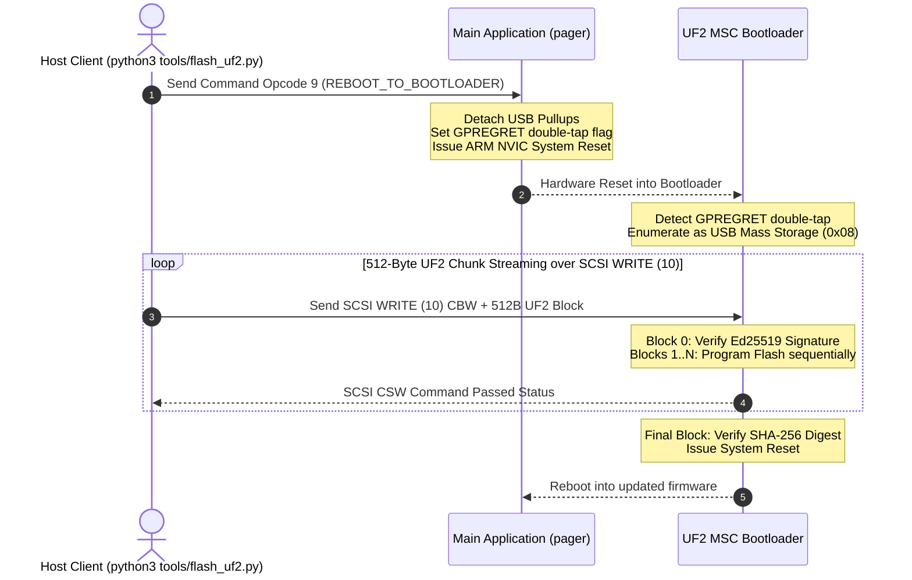

# Pager USB protocol v1

Pager exposes a vendor-specific WebUSB bulk interface (`0xFF`) alongside CDC-ACM serial for logs and emergency DFU recovery. Host applications claim the vendor interface and communicate via bulk endpoints.

> [!NOTE]
> All build tooling, WebUSB interfaces, Python scripts, and hardware HIL tests are target-bound to **macOS** and executed strictly locally (no remote CI/CD pipelines).

## Frame Structure

All frames are little-endian and can span multiple USB transfers.

| Offset | Size | Field |
| --- | ---: | --- |
| 0 | 4 | ASCII `PGR1` |
| 4 | 1 | Protocol version (`1`) |
| 5 | 1 | Kind: command `1`, response `2`, event `3`, error `5` |
| 6 | 4 | Request ID; zero for unsolicited events/errors |
| 10 | 2 | Payload length, maximum 512 |
| 12 | 4 | IEEE CRC-32 of payload |
| 16 | n | Payload |

The device rejects an invalid header, version, length, kind, or CRC.

## Error Kinds & Error Codes

When `kind` is `5` (`Error`), the single-byte error payload indicates:
- `1`: `ERR_BAD_REQUEST` — Malformed frame header or invalid parameters
- `2`: `ERR_UNSUPPORTED_COMMAND` — Unknown opcode
- `3`: `ERR_BUSY` — Resource currently locked or busy
- `4`: `ERR_DFU` — Bootloader reboot or flashing failed

## Control Commands

Command payloads contain a one-byte opcode followed by parameters:

| Opcode | Name | Description / Payload | Response Payload |
| ---: | --- | --- | --- |
| `1` | `PING` | Health check | ASCII `PONG` |
| `2` | `GET_INFO` | Device metadata | ASCII `Pager;protocol=1` |
| `3` | `GET_KEYBOARD_STATE` | Get active slot & bonds | `active_slot, pairing_mode, bonded0, bonded1, bonded2` |
| `4, slot` | `SWITCH_PROFILE` | Switch active BLE profile (0–2) | status byte (`0`) |
| `5` | `ENABLE_PAIRING` | Enter BLE pairing mode | status byte (`0`) |
| `6` | `DISCONNECT` | Disconnect active BLE client | status byte (`0`) |
| `7, slot` | `CLEAR_PROFILE` | Clear bond on profile (0–2) | status byte (`0`) |
| `8, utf8…` | `TYPE_TEXT` | Emulate keyboard typing (max 128B) | status byte (`0`) |
| `9` | `REBOOT_TO_BOOTLOADER` | Trigger GPREGRET double-tap & reboot | Device detaches USB and enters UF2 MSC bootloader |
| `10` | `GET_LOGS` | Retrieve last 32 diagnostic log entries | UTF-8 newline-separated log string |

## DFU Sequence Workflow

Firmware updates use the **Single-Slot USB Mass Storage UF2 Bootloader**:

## Memory Layout Summary

- **Bootloader**: `0x0000_0000` – `0x0000_BFFF` (48 KiB)
- **Manifest Header**: `0x0000_C000` – `0x0000_C0FF` (256 B)
- **Main Application**: `0x0000_C100` – `0x000F_DFFF` (903.75 KiB)
- **Storage & Bonds**: `0x000F_E000` – `0x000F_FFFF` (8 KiB)
